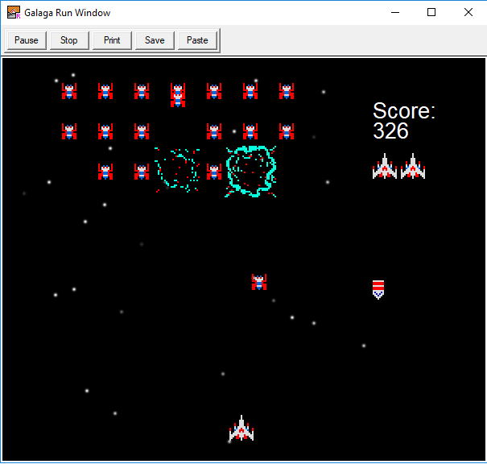

# Galaga

A game I made for a high school class in Turing.

The standalone EXE doesn't run but ive included a copy of Turing, just open the Galaga.t file and run.

The game is very basic and a lot of the code is just if logic but I was very proud of this when I made it and it still works really well.

